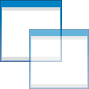
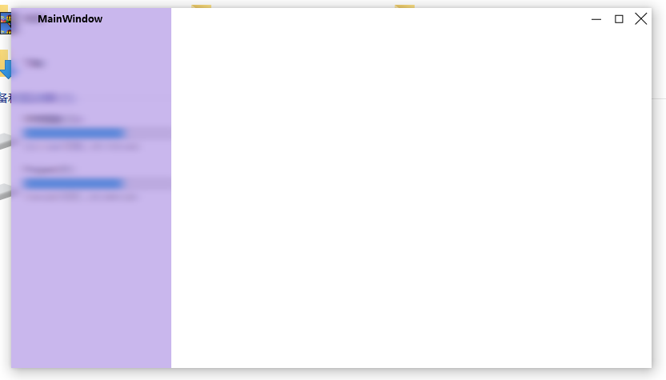
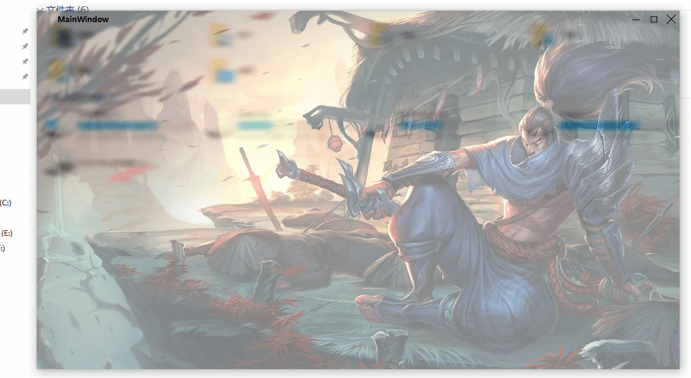
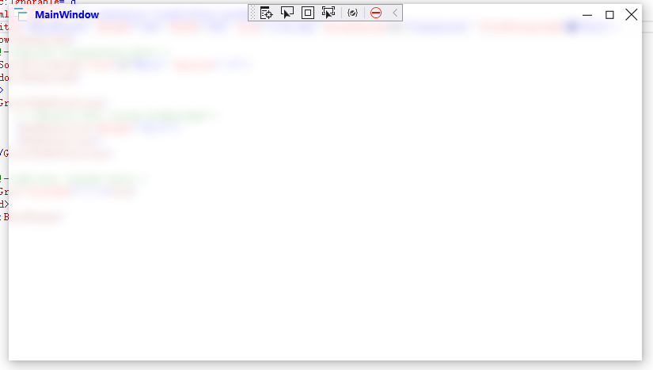
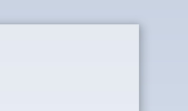
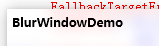
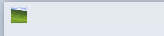
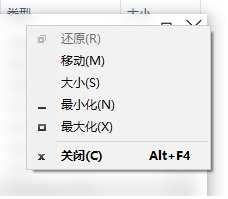
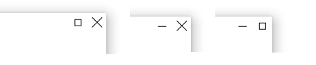
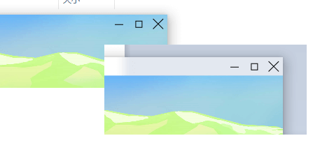

# BlurWindow

<p align="center">
 
</p>
</p>
<p align="center">
<a href="https://github.com/TianXiaTech/BlurWindow/stargazers" target="_blank">
 
</a>
<a href="https://github.com/TianXiaTech/BlurWindow/releases" target="_blank">
 
</a>
<a href="https://github.com/TianXiaTech/BlurWindow/network/members" target="_blank">
 
</a>
<a href="https://github.com/TianXiaTech/BlurWindow/issues" target="_blank">
 
</a>
</p>

WPF Aero Glass Lib  

~~**Only Windows 10 and Windows 11(before 22H2) are supported**~~
**Support Windows 10 and Windows 11**

> The window style is located in Theme.xaml and can be modified by yourself.  
> This project is part of [TianXiaTech](https://github.com/TianXiaTech)

## Nuget
`
PM>Install-Package BlurWindow -Version 7.0.0
`  

## Usage
### Step 1
import xaml prefix  
```
xmlns:blurwindow="clr-namespace:TianXiaTech;assembly=BlurWindow";
```

### Step2
Replace **&lt;Window&gt;&lt;/Window&gt;** with **&lt;blurwindow:BlurWindow&gt;&lt;/blurwindow:BlurWindow&gt;**

### Step3  
Make MainWindow inherit from TianXiaTech.BlurWindow  
```
public partial class MainWindow : TianXiaTech.BlurWindow
```

### Step4  
Specify background transparency 

```
<Window.Background>
    <!--Specify transparency here-->
    <SolidColorBrush Color="White" Opacity=".5"/>  
 </Window.Background>
```

If OS Version is Windows 11(greater than 22H2), the following additional properties need to be specified
```
   <!--Specify acrylic transparency-->
   AcrylicOpacity="128"
```


## Additional
**You can set the window to be partially transparent, like below**  
```
<Grid>
    <Grid.ColumnDefinitions>
        <ColumnDefinition Width="*"/>
        <ColumnDefinition Width="3*"/>
    </Grid.ColumnDefinitions>

    <Grid  Grid.Column="0">
        <Grid.Background>
            <SolidColorBrush Color="MediumPurple" Opacity=".5"/>
        </Grid.Background>
    </Grid>

    <Grid Grid.Column="1" Background="White"/>
</Grid>
```
<p align="center">
 
</p>  

**You can also set the picture background directly**  
```
<Grid>
    <Grid.Background>
        <ImageBrush ImageSource="yasuo.jpg" Stretch="UniformToFill" Opacity=".5"/>
    </Grid.Background>
</Grid>
```
<p align="center">
  
</p>

**Title foreground**
```
        TitleForeground="Blue"
```
<p align="center">
  
</p>

**ControlBox Visibility**
```
        ControlBoxVisibility="Visibility.Collapsed"
```
<p align="center">
  
</p>

**Icon Visibility**
```
        IconVisibility="Visibility.Collapsed"
```
<p align="center">
  
</p>

**Title Visibility**
```
        TitleVisibility="Visibility.Collapsed"
```
<p align="center">
  
</p>

**IsEnable ContextMenu**
```
        IsEnableContextMenu="true"
```
<p align="center">
  
</p>

**ControlBox Button Visibility**
```
        MinimizeVisibility = Visibility.Collapsed
        MaximizeVisibility = Visibility.Collapsed
        CloseVisibility = Visibility.Collapsed
```
<p align="center">
  
</p>

**ContentSpan**
```
        ContentSpan = "true"
```
<p align="center">
  
</p>

## Sample screenshot

### Opacity 0.8
<p align="center">
 
</p>

### Opacity 0.5
<p align="center">
 
</p>

## Todo
* Use WPF attached property

## Thanks
Project reference https://github.com/TranslucentTB/TranslucentTB and https://github.com/riverar/sample-win32-acrylicblur

## License

[MIT License](LICENSE).


