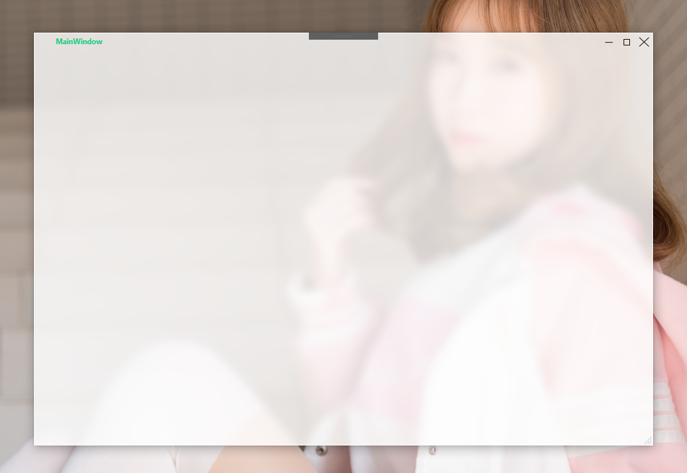
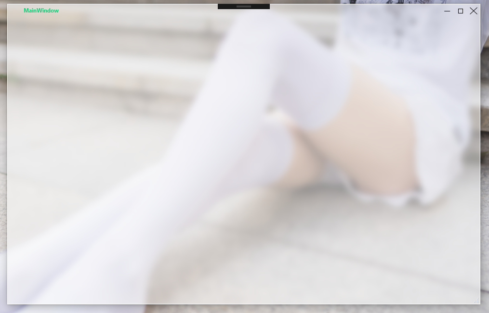
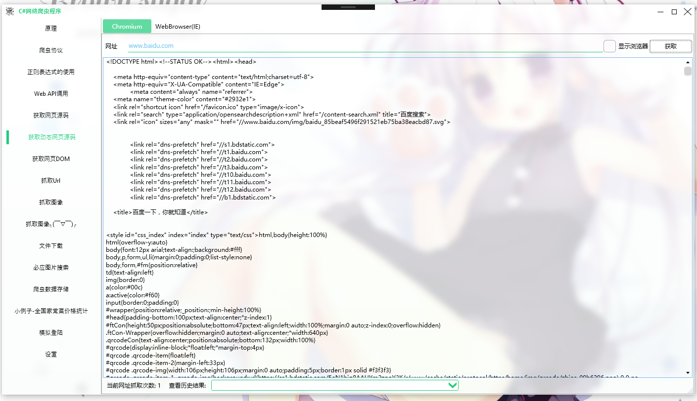

# BlurWindow
WPF Aero Glass Lib

> The window style is located in Theme.xaml and can be modified by yourself.  
> This project is part of [TianXiaTech](https://github.com/TianXiaTech)

## Nuget
`
PM>Install-Package BlurWindow -Version 1.0.0.1
`  

## Usage
### Step 1
import xaml prefix  
`
xmlns:blurwindow="clr-namespace:TianXiaTech;assembly=BlurWindow";
`

### Step2
Replace **&lt;Window&gt;&lt;/Window&gt;** with **&lt;blurwindow:BlurWindow&gt;&lt;/blurwindow:BlurWindow&gt;**

### Step3  
Make MainWindow inherit from TianXiaTech.BlurWindow  
`
public partial class MainWindow : TianXiaTech.BlurWindow
`

### Step4  
Specify background transparency
`
 <Window.Background>
    <!--Specify transparency here-->
    <SolidColorBrush Color="White" Opacity=".5"/>
 </Window.Background>
`

## Sample screenshot

### Opacity 0.8

 

### Opacity 0.5

 

### Actual use effect

 

## Thanks
Project reference https://github.com/TranslucentTB/TranslucentTB

## License

[MIT License](LICENSE).

